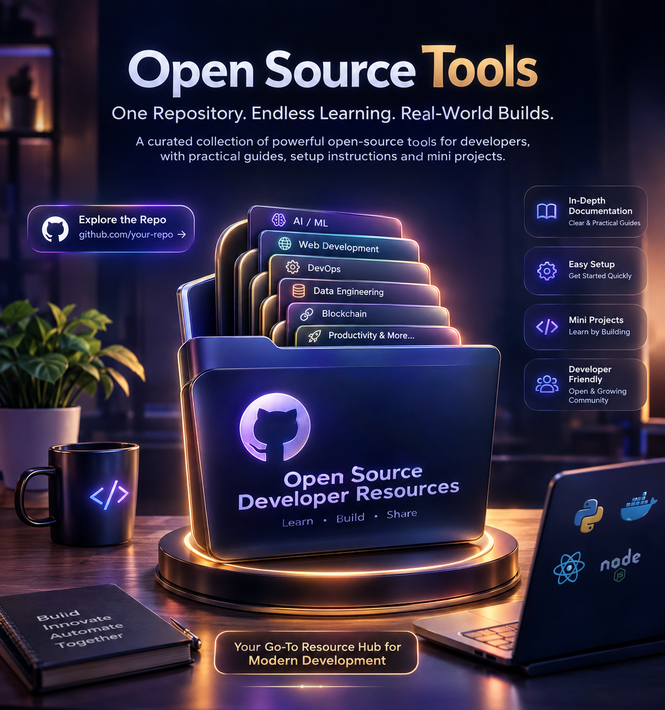

# Developer Tools — Resource Library

A growing, hands-on library of guides to the tools developers actually reach for day to day — AI tools, core dev tools, and open-source software — each one covered deeply enough to genuinely master, not just install and forget.

## Why this exists

We're in a moment where AI can write code in seconds, which means writing code is no longer the bottleneck — knowing the *tools around the code* is. Being able to expose a local server to the internet, containerize an app properly, wire up an automation pipeline, debug a real bug with a real debugger, or evaluate which open-source AI tool actually fits your use case — that's the skill that separates someone who can ship real, working software from someone who can only generate snippets and hope they work.

At the same time, the tooling landscape is moving fast. New open-source AI tools, frameworks, and dev-productivity tools show up constantly, and most of them can genuinely be learned and mastered quickly if you approach them the right way — by understanding *why* they exist, not just copying install commands. This repo is a personal reference library built on that idea: pick a tool, understand the problem it solves, install and configure it properly, and prove you understand it by working through a real scenario, not a toy demo.

## What kinds of tools live here

This repo isn't scoped to one category — it grows in three overlapping directions:

- **Core dev tools** — the everyday utilities of software engineering: tunneling (ngrok), containerization (Docker), IDEs and debuggers (Visual Studio), browser debugging tools, version control, terminal utilities, API testing tools, and similar foundational tooling.
- **AI tools** — the fast-moving layer of LLM-adjacent tooling: agent frameworks, local model runners, vector databases, prompt/eval tooling, AI-assisted coding tools, and workflow builders with AI nodes (like n8n). These are covered the same way as any other tool here — real install steps, real configuration, real scenarios — because "it's AI" doesn't mean it gets a pass on rigor.
- **Open-source tools worth mastering** — free, self-hostable, inspectable software that solves a real problem well enough that learning it deeply pays off, rather than tools that are trendy for a week and forgotten.

A tool earns a place here because it's genuinely useful and has a real reason to be reached for — not because it's popular. The goal is depth over breadth: fewer tools, each properly understood, rather than a huge list nobody ever actually opens twice.

## Naming convention

Folders are named after the tool itself, lowercase, matching how you'd normally type it (`ngrok`, `docker`, `n8n`) — multi-word tool names use hyphens (`visual-studio-community`, `browser-devtools`). This keeps folder names predictable enough to guess without checking the table above.

## Who this is for

This repo is written for developers who already know how to code but want to close the gap between "can write code" and "can build and ship real things." That includes:

- Someone comfortable in one language/stack who keeps hitting tools they've only ever half-configured (Docker, ngrok, a proper debugger) and wants a real reference instead of a scattered mix of Stack Overflow answers.
- Someone exploring the fast-moving AI/open-source tooling space who wants to evaluate a tool by actually using it in a realistic scenario, not just reading a landing page.
- Anyone who's used to AI generating code quickly and wants to build the surrounding skill set — running it, exposing it, debugging it, automating it — so the AI-written code turns into something that actually ships.

It assumes basic command-line comfort but doesn't assume prior familiarity with any specific tool covered here — each README is written to be picked up cold.

## How it's organized

Every tool gets its own folder, named after the tool:

```
<tool-name>/
├── README.md           # what it is, why it matters, install, configure, real scenario walkthrough
└── mini-project/        # actual runnable code for that scenario
```

Each README follows the same fixed structure, so any tool in this repo can be skimmed, compared, or picked up cold the same way:

1. **What it is** — a plain-language explanation, no jargon assumed.
2. **Why this tool exists / the problem it solves** — the actual pain point that led to this tool being built, so the rest of the README makes sense in context.
3. **Why it matters in the AI era** — how this tool fits into building, debugging, or shipping AI-assisted software today.
4. **Install** — exact commands, per OS where relevant, plus how to verify the install worked.
5. **Configure** — the setup steps people usually skip and then get stuck on (auth tokens, environment variables, persistent volumes, secrets).
6. **Core use cases** — the handful of situations where this is the right tool to reach for.
7. **Real-life scenario** — a genuine, working mini-project that mirrors an actual real-world task (not a "hello world" that teaches nothing about how the tool behaves under real conditions).
8. **Common pitfalls** — the mistakes people actually make, and how to recognize them.
9. **Resources** — official docs and further reading, nothing random.

## Tools covered so far

| Tool | Category | What it's for | Real-life scenario |
|---|---|---|---|
| [ngrok](ngrok/README.md) | Core dev tool — networking / tunneling | Exposing a local server to the public internet | Building a signature-verified GitHub webhook receiver |
| [docker](docker/README.md) | Core dev tool — containerization | Packaging and running apps in isolated, portable containers | A multi-container API + Redis cache with persistent volumes |
| [n8n](n8n/README.md) | AI / automation — workflow builder | Self-hosted, visual automation and AI-agent pipelines | A scheduled price-monitoring alert pipeline |
| [visual-studio-community](visual-studio-community/README.md) | Core dev tool — IDE / debugging | Full-featured, free IDE with a serious debugger | Finding and fixing a real bug in a REST API with the debugger |
| [browser-devtools](browser-devtools/README.md) | Core dev tool — frontend debugging | Inspecting and debugging a page's live runtime behavior | Diagnosing duplicate network requests and a memory leak |
| [supabase](supabase/README.md) | Open source / AI-ready backend | Postgres + Auth + Realtime as a hosted or self-hostable backend | A multi-user app secured by Row Level Security, synced live |
| [telegram](telegram/README.md) | Core dev tool — bots / messaging | Free, instant chat-based bot interface | A real personal expense-tracking bot with per-user data |
| [swagger](swagger/README.md) | Core dev tool — API docs / contract | Documenting and enforcing a REST API's contract | A contract-first API that rejects any request violating its own spec |
| [postman](postman/README.md) | Core dev tool — API testing | Manual and automated HTTP API testing | A CI-runnable auth test suite with positive and negative tests |
| [supabase-cli](supabase-cli/README.md) | Core dev tool — local backend dev | Running the full Supabase stack locally, migrations as code | A local migration → seed → typed → Edge Function workflow |
| [groq](groq/README.md) | AI tool — low-latency inference | Ultra-fast LLM inference (LPU hardware) for real-time AI features | Real-time ticket triage + a live streaming latency benchmark |
| [vercel](vercel/README.md) | Core dev tool — deployment (serverless) | Deploying frontends + serverless functions, zero server management | A waitlist app with a real serverless API, deployed to a live URL |
| [render](render/README.md) | Core dev tool — deployment (persistent) | Deploying always-on web services, workers, and cron jobs | A persistent counter service + a scheduled job, deployed as one Blueprint |
| [streamlit](streamlit/README.md) | Open source — Python data apps | Turning a Python script into an interactive web app | A filterable sales dashboard, deployed live to Streamlit Community Cloud |

Fourteen tools in, three categories represented — the table above will keep growing as new folders get added; treat it as the changelog for this repo.

## Where this is headed

There's no committed release schedule, but the categories below are the likely next directions this repo grows into — listed here so it's clear this table is a snapshot, not the ceiling:

- **More AI tooling**: local model runners (e.g. Ollama), vector databases, agent/orchestration frameworks, prompt evaluation tooling.
- **More core dev tooling**: version control workflows beyond the basics, terminal productivity tools, API testing/design tools, CI basics.
- **More debugging & observability**: logging/tracing tools, performance profilers beyond the browser, database query debugging.

If you have a specific tool in mind that fits the "genuinely useful, has a real reason to be reached for" bar described above, it's a good candidate for the next addition.

## This is a living, growing repo

There's no fixed roadmap and no finish line — new tools get added whenever there's something genuinely worth learning next. Expect this table to keep growing across all three directions described above: more core dev tools, more AI/open-source tooling, more debugging and productivity tools. Some entries may also get revisited and deepened over time as better real-world scenarios come to mind, or as a tool itself evolves.

If you're coming back to this repo after a while, the table above is the fastest way to see what's new — check it first before assuming you've seen everything here.

## How to use this repo

1. **Pick a tool folder** — either one you already know you need, or browse the table above for something worth learning.
2. **Read its README top to bottom** — don't skip the "why it exists" section; it's what makes the install and configuration steps actually make sense instead of feeling like arbitrary commands to copy.
3. **Actually run the mini-project.** This is the part that matters most. Reading about a bug is not the same as watching your own debugger catch it; reading about a webhook is not the same as watching a real request land on your machine. The scenarios are deliberately built to be run, not just skimmed.
4. **Hit a pitfall?** Check the "Common pitfalls" section in that tool's README before assuming something is broken — most of the rough edges people hit have already been documented there.
5. **Move on once you could explain the "why" to someone else.** Mastery here isn't about having run the commands once — it's being able to explain why the tool exists and when you'd reach for it again without needing to re-read the README.

## Contributing to this repo (if you're extending it yourself)

When adding a new tool, follow the exact same folder shape and README structure described above — consistency is what makes this repo skimmable as it grows. A new entry should include a real, runnable `mini-project`, not just prose describing what one would look like. If a tool doesn't have a genuine real-world scenario behind it yet, it's not ready to be added.

## FAQ

**Why not just link to each tool's official docs?**
Official docs are usually reference material, not a guided path — they explain every option but rarely show you a complete, realistic scenario end to end. This repo exists to fill that gap, with the official docs still linked at the bottom of every README for when you need the full reference.

**Why "mini-project" and not just a code snippet?**
A snippet proves a syntax works. A mini-project proves you understand how the tool behaves under a condition that actually matters — a webhook getting a forged request, a container losing its data on restart, a debugger catching a bug that only shows up after real usage. That's the level of understanding this repo is aiming for.

**Do I need to follow the tools in a specific order?**
No — each folder is self-contained and can be read independently. Jump straight to whatever tool you need right now.

**What if a tool changes and a README goes stale?**
Install steps and UI details drift over time (a flag gets renamed, a dashboard gets redesigned) faster than "why this tool exists" does. If something in an Install/Configure section stops matching reality, that section gets refreshed — the surrounding "why" sections tend to stay accurate much longer, which is by design.

---

That's the whole idea: fewer tools, understood properly, proven by actually building something real with each one. New folders get added as this repo keeps growing.
